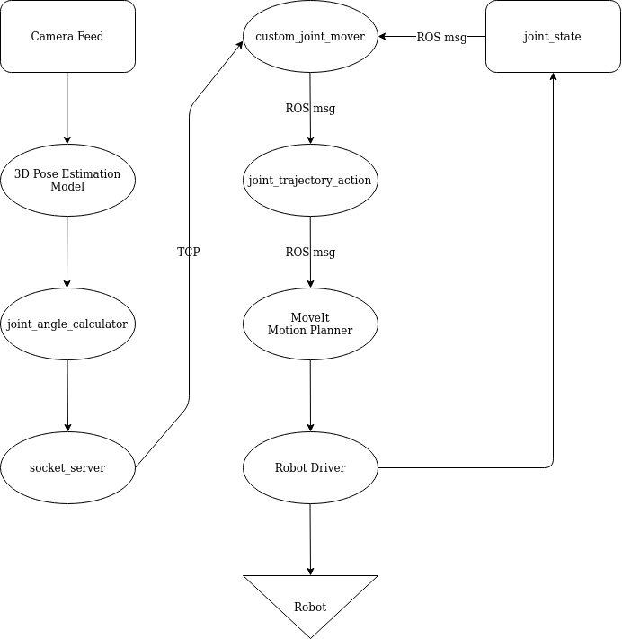

# Robot Teleoperation using Real-time 3D Huaman Pose Estimation 

This ROS package is a proof of concept demonstrating a method of controlling two robot manipulators by mirroring human arm poses captured in real-time. 

Live demo with commentary: https://youtu.be/JviMLEeE7u8 


## Table of Contents
- [Overview](#overview)
- [Requirements](#requirements)
- [Setup](#setup)
- [Install](#install)
- [Usage](#usage)
- [How it works](#how-it-works)
- [Discussion](#discussion)
- [Future goals](#future-goals)

## Overview

In practice, manually controlling a robot and deviating it off a pre-programmed path can be often either highly imprecise or highly arduous. Existing human-in-the-loop solutions in commercial robots presently involve the robot driver being sent jogging commands by a handheld controller or other hardware input device. Significant data is lost in the process of a human operator translating their movement intention into joystick or button inputs. In addition, the human operator takes on significant mental load in the form of having to extrapolate every action into 3D space from a third person perspective. This may lead to slower than desired operation or worse, human error.

The most precise and instinctive method by which we humans use to interact with the physical world around us is by none other than manipulating the limbs of our own body. Current master-slave implementations within the industry involve devices that are highly specific to a single robot, importable, expensive, and generally unscaleable. Having a cost-free and universal method of control that allows untrained human operators to move the limbs of a robot as if it were an extension their own body may lead to the opening of new doors within the robotics industry for applications that extend beyond automation.

# Use cases
* Telerobotics
* Kinesthetic teaching
* Supervised learning 

## Requirements
* Ubuntu 18.04 LTS
* ROS Melodic Morenia
* Python >= 3.6
* Pytorch >= 1.6
* Numpy >= 1.17
* OpenCV >= 4.0
* CUDA-capable GPU

## Setup
Step 1:
[Create a Catkin workspace](http://wiki.ros.org/melodic/Installation/Source#Create_a_catkin_Workspace)

Step 2:
[Install the ROS-Industrial packages](http://wiki.ros.org/Industrial/Install)

## Install
Build from source into your Catkin workspace:
```
cd catkin_ws
git clone https://github.com/jasongedev/handsfree-teleop/ src/handsfree_teleop
pip3 install -r src/handsfree_teleop/pose_estimation/requirements.txt
rosdep -r install
catkin build -j7
source devel/setup.bash
```

Optional: to obtain 100hz trajectory update rate as shown in the examples:
```
echo "$(awk '/robot_interface_simulator.launch/ { print; print "      <param name=\"pub_rate\" value="100" />"; next}1'  src/motoman/motoman_sda10f_moveit_config/launch/moveit_planning_execution.launch)" > src/motoman/motoman_sda10f_moveit_config/launch/moveit_planning_execution.launch
```

## Usage

From three seperate terminals within your Catkin workspace:
```
$ roslaunch motoman_sda10f_moveit_config moveit_planning_execution.launch sim:=true
```
```
$ roslaunch handsfree_teleop_launch teleop.launch
```
To stream video input from webcam:
```
$ python3 src/handsfree_teleop/pose_estimation/main.py --video /dev/video0
```
OR 

To stream a pre-recorded video:

```
$ python3 src/handsfree_teleop/pose_estimation/main.py --video {VIDEO_FILEPATH.mp4}
```


## How it works



## Future goals

* Abstract ```custom_joint_mover``` to work universally with any MoveIt! configuration by parameterizing joint names from the yaml file.  
* Implement a 3D Pose Estimation model trained on RGBD input for improved accuracy. Depth sensors are now ubiquitous, every new iPhone has one.
* Implement a 3D Hand Pose Estimation model to enable precise control of end-effectors as well as increasing degrees of freedom from 4 to 6 per arm.
